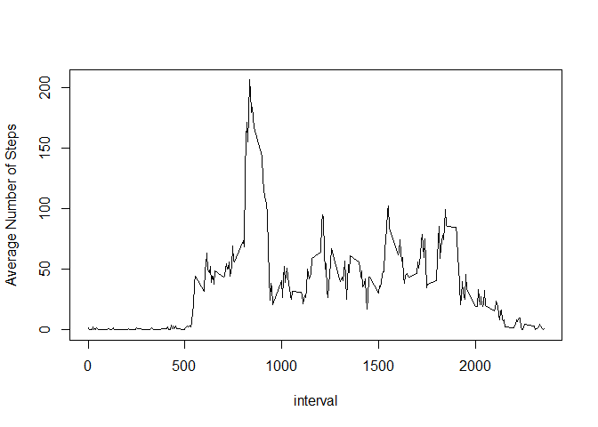

# Reproducible Research: Peer Assessment 1


## Loading and preprocessing the data

Loading and preprocessing the data is done with this code:


```r
# create the folder that will contain data file
if (!file.exists("data")) { dir.create("data") }
# unzip the archive and store it in the <./data> folder
unzip("./activity.zip",exdir="./data")

# read the data
AMD_original <- read.csv("data/activity.csv",
                         header=1,
                         sep=",",
                         na.strings="NA"
)

# convert column with the date into a proper format
AMD_original$date <- as.POSIXct(AMD_original$date)
```

## What is mean total number of steps taken each day?

The Histogram of the total number of steps taken each day is obtained using this code (note that mean and median are also added):


```r
# Total Number of Steps taken each day
TotalNumberOfStepsEachDay <- aggregate(steps~date, data=AMD_original, FUN=sum, na.rm=TRUE)

# Histogram of the Total Number of Steps taken each day
hist(TotalNumberOfStepsEachDay$steps,
     breaks=50,
     col="red", 
     xlab="Number Of Steps Taken Each Day", 
     ylab="Frequency (days)", 
     main="Histogram of Total Number Of Steps"
     )

# Mean and Median are added onto the plot
abline(v = median(TotalNumberOfStepsEachDay$steps), col = "blue", lwd = 1)
abline(v = mean(TotalNumberOfStepsEachDay$steps), col = "green", lwd = 1)
```

<!-- -->

Mean and median numbers of steps taken each day can be found using this code:


```r
mean(TotalNumberOfStepsEachDay$steps)
```

```
## [1] 10766.19
```

```r
median(TotalNumberOfStepsEachDay$steps)
```

```
## [1] 10765
```

It is possible to see that the mean and the median are different.


## What is the average daily activity pattern?

In order to construct the time series plot of the average number of steps taken, the data must be "aggregated" using the following code:


```r
# Average Number of Steps taken over intervals
AverageNumberOfStepsOverInterval <- aggregate(steps~interval, data=AMD_original, FUN=mean, na.rm=TRUE)
```

Time series plot of the average number of steps taken is constructed using this code:


```r
# Plot of Average Number of Steps taken over intervals
with(AverageNumberOfStepsOverInterval,
     plot(steps~interval, 
          type="l",
          col="black", 
          xlab="interval", 
          ylab="Average Number of Steps"
          )
     )
```

<!-- -->

In order to find the 5-minute interval that, on average, contains the maximum number of steps, the original data has to be put in descendng order in steps. Then, the top row is the row with the maximum number of average steps. 


```r
# Sorting the original data and accessing the first row
AverageNumberOfStepsOverInterval[order(-AverageNumberOfStepsOverInterval$steps),][1,]
```

```
##     interval    steps
## 104      835 206.1698
```

The 5-minute interval that, on average, contains the maximum number of steps is identified as:


```r
# Accessing the correct row, column:
AverageNumberOfStepsOverInterval[order(-AverageNumberOfStepsOverInterval$steps),]$interval[1]
```

```
## [1] 835
```


## Imputing missing data

The strategy for imputing missing data is the following:

1. Separate the original data into two data frames: one containing the good data and the other one containing missing data

2. Find the mean for each 5-min interval from the good data

3. Use it to populate the data frame with missing data

4. Append the populated data frame to the data frame with good data

Before imputing missing data, let us calculate the total number of missing values with this code:

```r
dim(AMD_original[is.na(AMD_original$steps),])[1]
```

```
## [1] 2304
```

Step 1 is done with this code:

```r
AMD_GoodData <- AMD_original[!is.na(AMD_original$steps),]
AMD_BadData  <- AMD_original[is.na(AMD_original$steps),]
```

Step 2 is done with this code:

```r
meanAMD_GoodData <- aggregate(steps~interval, data=AMD_GoodData, FUN=mean)
```

Step 3 is done with this code:

```r
AMD_BadData$steps <- meanAMD_GoodData[meanAMD_GoodData==AMD_BadData$interval,2]
```

Step 4 is done with this code:

```r
AMD_Populated <- rbind(AMD_GoodData, AMD_BadData)
```

Quick check that the dimensions of the data frames are the same:

```r
# check the dimensions of the data frames are the same
dim(AMD_BadData)[1]+dim(AMD_GoodData)[1]==dim(AMD_original)[1]
```

```
## [1] TRUE
```

```r
# check that there are no NA in the new data frame
dim(AMD_Populated[is.na(AMD_Populated$steps),])[1]
```

```
## [1] 0
```


The Histogram of the total number of steps taken each day is obtained using this code (note that mean and median are also added):


```r
# Total Number of Steps taken each day
TotalNumberOfStepsEachDay <- aggregate(steps~date, data=AMD_Populated, FUN=sum)

# Histogram of the Total Number of Steps taken each day
hist(TotalNumberOfStepsEachDay$steps,
     breaks=50,
     col="red", 
     xlab="Number Of Steps Taken Each Day", 
     ylab="Frequency (days)", 
     main="Histogram of Total Number Of Steps with Added Missing Values"
     )

# Mean and Median are added onto the plot
abline(v = median(TotalNumberOfStepsEachDay$steps), col = "blue", lwd = 1)
abline(v = mean(TotalNumberOfStepsEachDay$steps), col = "green", lwd = 1)
```

<!-- -->

Mean and median numbers of steps taken each day can be found using this code:


```r
mean(TotalNumberOfStepsEachDay$steps)
```

```
## [1] 10766.19
```

```r
median(TotalNumberOfStepsEachDay$steps)
```

```
## [1] 10766.19
```

It is possible to see that the mean stayed the same as it was before adding missing values. The median now is the same as the mean after the missing values were added with this procedure.


## Are there differences in activity patterns between weekdays and weekends?

Factor variable indicating whether a given date is a weekday or weekend day is created in the following code:


```r
# Specifying days that are not weekend days
weekdays1 <- c('Monday', 'Tuesday', 'Wednesday', 'Thursday', 'Friday')

# convert to `factor` and specify the `levels/labels`
AMD_Populated$wDay <- factor( (weekdays(AMD_Populated$date) %in% weekdays1),
                              levels=c(FALSE, TRUE),
                              labels=c('weekend', 'weekday')
                              )
```

The data now must be "aggregated" using the following code:


```r
# Aggregation of data
AMD_PopulatedNew <- aggregate(steps ~ interval+wDay,data = AMD_Populated,FUN = mean)
```

The panel plot will be constructed in ggplot2 with this code:


```r
# Constructing the plot (and loading library ggplot2)
library(ggplot2)
finalPlot <-
  ggplot(data=AMD_PopulatedNew,
         mapping=aes(interval, steps) ) +
  geom_line() +
  ggtitle("The average number of steps taken across weekdays/weekends") +
  xlab("Interval") +
  ylab("Number of steps") +
  facet_wrap(facets=~wDay,nrow=2,ncol=1,strip.position="top")

# Printing the plot on the screen
print(finalPlot)
```

<!-- -->
